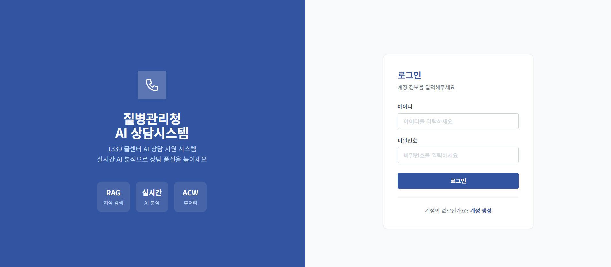
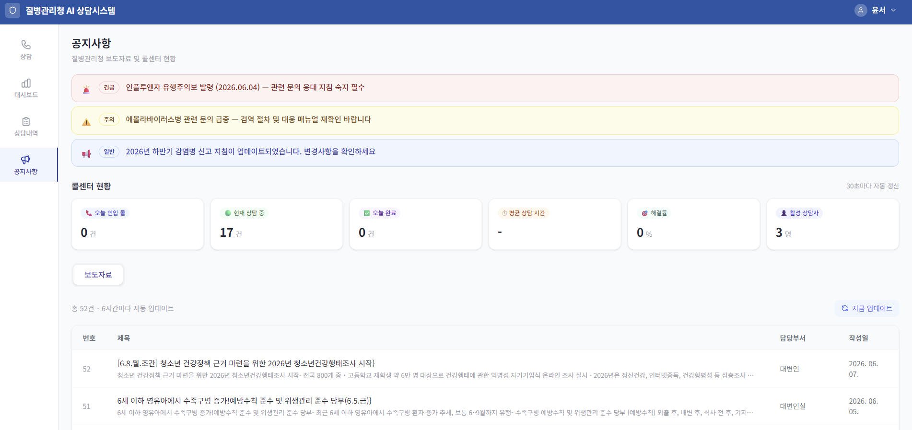
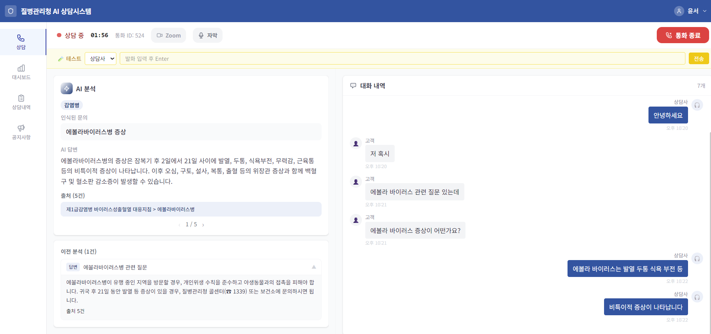
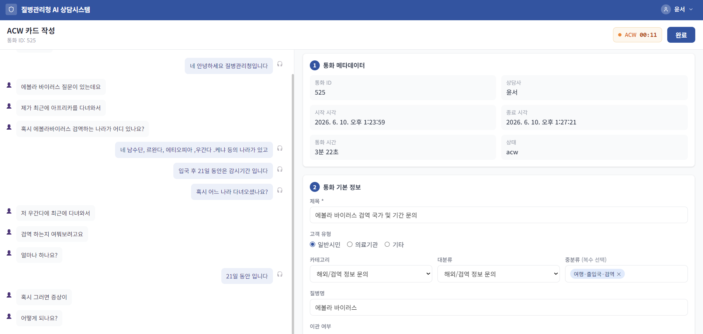
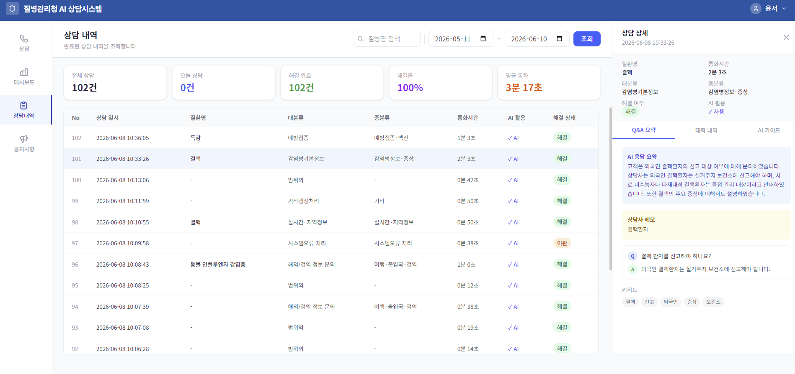
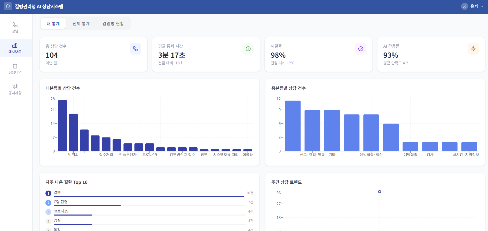

# Togyether — 질병관리청 1339 콜센터 AI 지원 시스템

> 캡스톤디자인 2026-1 | 동국대학교 데이터사이언스 소프트웨어 연계전공

질병관리청 1339 콜센터 상담사를 위한 AI 보조 시스템입니다.
고객 발화를 실시간으로 분석하여 관련 감염병 정보를 자동으로 검색·제공하고,
상담 후처리(ACW) 카드를 자동 생성합니다.

---

## 배경 및 목적

1339 상담사의 업무 흐름을 분석해 문제점을 파악하고 솔루션을 도출했습니다.

| 단계 | 문제 | 솔루션 |
|------|------|--------|
| 📋 **상담 시작** | 최신 지침·공지 파악이 어려움 | 공지사항으로 최신 정보 확인 · 상담 전 빠른 지침 파악 |
| 🎧 **통화 중** | 통화하면서 지침 동시 검색 | STT 실시간 변환 + RAG AI 가이드 · 유형 분류 후 즉시 답변 제공 |
| ✅ **통화 종료** | 상담 내용 수기 후처리 반복 | Q&A 키워드 자동 생성 · 상담 종료 즉시 자동 후처리 |
| 📊 **대시보드** | 상담 데이터 관리 불가 | 상담내역 조회 + 통계 시각화 · 누적 데이터 한눈에 분석 |

---

## 화면 소개

**로그인**


**공지사항**


**상담 중**


**ACW 후처리**


**상담 내역**


**대시보드**


> 더 많은 화면은 [docs/images](docs/images) 참고

---

## 시연 영상

[](https://www.youtube.com/watch?v=KJLPVOSKUXU)

---

## 시스템 파이프라인

### 상담 중
```
고객/상담사 음성
      ↓
Deepgram Nova-3 (실시간 STT · 화자 분리)
      ↓
GPT-4.1-mini (의도 분류 · 대화 컨텍스트 누적)
      ↓
카테고리 분류
  ├─ 감염병 → Hybrid RAG (BM25 + Dense Vector) → GPT-4o-mini 답변 카드
  ├─ 예방접종 → 공공데이터포털 예방접종 API → 접종카드
  ├─ 해외검역 → 공공데이터포털 검역 API → 검역카드
  ├─ 지식정보 → 사이트 연결 → 링크카드
  └─ 이관 → 이관기관 전체 카드&업체명 검색 → 이관카드
```

### 상담 후
```
통화 종료 (건수·해결률·통화시간)
      ↓
GPT-4.1-mini → 후처리 문서 자동 생성 (제목·요약·고객유형·분류·이관여부)
      ↓
상담사 확인 및 수정 → DB 저장

대시보드
  ├─ 상담내역 DB → 내 통계 / 전체 통계 (월간 질병 추이)
  ├─ 공공데이터포털 감염병 API → 감염병 현황 실시간 대시보드
  └─ KDCA 크롤러 → 공지사항 페이지 (질병관리청 보도자료)
```

---

## 주요 기능

- 🎙️ **실시간 STT** — Deepgram Nova-3 기반 듀얼 채널 실시간 음성 인식
- 🔍 **Hybrid RAG 검색** — Dense + BM25 + Cross-encoder rerank로 관련 감염병 정보 제공
- 🧠 **의도 분류** — 고객 발화를 카테고리(감염병/예방접종/이관 등)로 자동 분류
- 📋 **ACW 자동 생성** — 상담 종료 후 후처리 카드 자동 작성
- 🏥 **이관기관 안내** — 타기관 연결이 필요한 경우 관련 기관 정보 제공

---

## 기술 스택

| 분류 | 기술 |
|------|------|
| **Backend** | FastAPI, Python |
| **Frontend** | React, Vite |
| **DB** | PostgreSQL + pgvector (Supabase) |
| **STT** | Deepgram Nova-3 |
| **AI / RAG** | OpenAI text-embedding-3-small, BM25, Cross-encoder |
| **LLM** | GPT-4o-mini |

---

## 프로젝트 구조

```
Project/
├── backend/              # FastAPI 백엔드
├── frontend/             # React + Vite 프론트엔드
├── db/
│   ├── db_setup_v2.sql   # DB 스키마
│   └── scripts/
│       ├── load_all.py   # 지식베이스 전체 적재
│       ├── parsers/      # 데이터 전처리 파서
│       └── raw/          # 원본 데이터 (gitignore)
├── eval/                 # 평가 코드
└── docs/                 # 설계 문서
```

---


## 평가 결과

| 평가 항목 | 결과 |
|-----------|------|
| RAG 유사도 (임계값 0.6 이상) | **92.3%** (571개 샘플) |
| 의도 분류 Category Accuracy | **84.3%** |
| LLM-as-Judge Overall (RAG vs 상담사) | **4.039 vs 3.703** (+0.336) |
| STT CER (Deepgram Nova-3) | **13.7%** (질병명 매핑 후처리로 개선) |

---

## 팀원

장윤서 · 백주원 · 황선민
